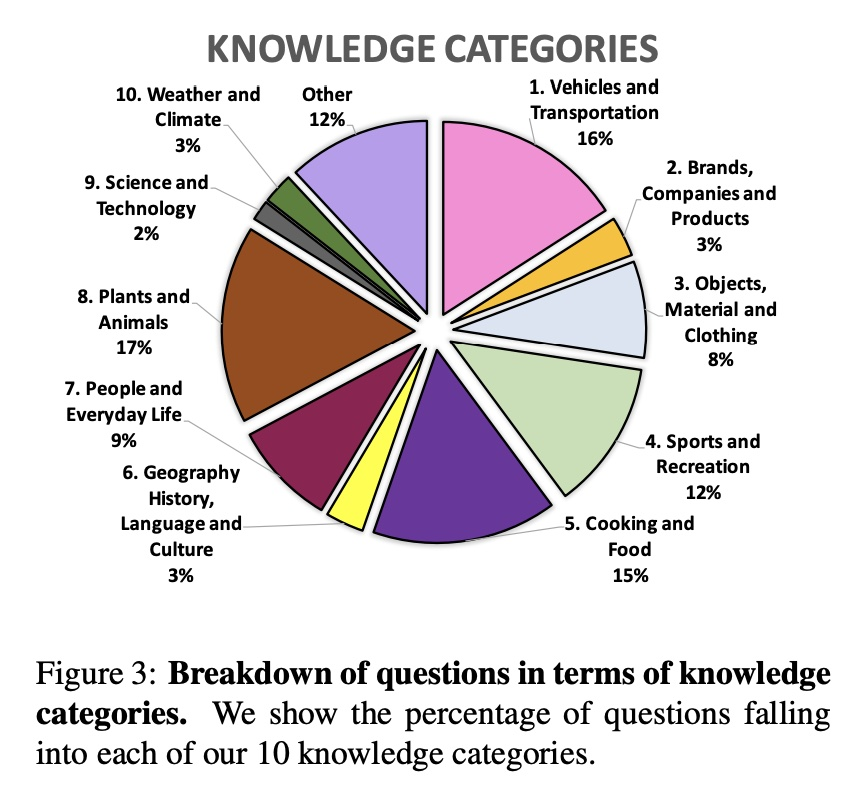

# Highly Semantic Vision-Language Benchmarks #

## Popular QA ##
### 1. VCR ###
#### a. Description ####
Visual Commonsense Reasoning. It is consisted of 290k multiple choice QA problems derived from 110k movie scenes. For every image, there are two types of questions asked. The first (What) question is about understanding of the visual scene in the image and the second (Why) question is asking about the rationale. When asking the second (Why) question, the correct answer choice of the first (What) question would also be provided. Every question has four answer choices. Three metrics are calculated, the first two correspond to the two questions respectively, Q2A(Question -> Answer) and QA2R(Question+Correct Answer -> Rationale). The last one is Q2AR which is basically the product of the first two measurements (Q2AR = Q2A x QA2R). There are overall 7 types of VCR questions separated via keywords. 
#### b. Pros ####
The most recognizable dataset for evaluating vision commonsense understanding costing millions of dollars. It is likely still the only highly-semantic VL dataset in Multiple Choice Question(MCQ) format. Lots of its questions are around human intention, emotions, causal and temporal relationships. Because its images are from movies scenes the visual scenes also have diverse varieties.
#### c. Cons #### 
Since its images are from movies, lots of its questions require context from frames before and after. Without enough context, it may be confusing even for human to answer (human oracle accuracy is only around 90%). The questions are heavily biased towards text information since text-only QA model can achieve more than 50% Q2A accuracy. For every question, the authors claim to first conduct adversarial matching across correct answer choices of other questions. Then via rule-based modification, the authors further modify those answer choices to serve as the  distractors. However, the final selected distractors for every question tend to have low qualities comparing with the correct answer choice and thus have space to be further improved. It has strict limited answer distribution thus make it difficult to evaluate generation models.

[Paper Link](https://arxiv.org/pdf/1811.10830.pdf)

### 2. VQA ###
#### a. Description #### 
VQA is a new dataset containing open-ended questions about images. These questions require an understanding of vision, language and commonsense knowledge to answer. It has 265,016 images (mostly from COCO caption dataset and abstract scenes). It also has at least 3 questions (5.4 questions on average) per image, 10 ground truth answers per question. It has two versions VQA V1 and V2. The V2 overall has a more balanced set for types of questions and answer choices. Comparing with VCR, VQA questions tend to include more on visually descriptive questions e.g. spacial relationships, attributes of objects, etc.
It has mainly two types of evaluation metrics, open-ended and multiple-choice. The multiple-choice is differenet from the MCQ in VCR. VCR strictly has four unique answer choices for each question. However in VQA, when answering a question, all the answer choices (including correct answer from other questions) are all provided at once. So the task is to select the correct ones among the large pool. Thus two questions can have the same pool of answer choice candidates.

#### b. Pros #### 
It is the most recognizable Visual Question Answering benchmark. Most of its images are from COCO Captions which are real images. It also includes abstract images which are cartoon images. Its question types are differentiated via starting words of the questions like How many xx?", "What colorxxx?", etc. It has a more diverse set of evaluation metrics, open-ended and multiple-choice which make it possible to evaluate generation models. 

#### c. Cons #### 
The questions are mostly semantically low-level thus it cannot be able to evaluate highly-semantic visual commonsense understanding. Since its question types are separated by starting words of the questions, past works have pointed out that models can learn strong language prior between question types and answer distributions. This bias may be mostly severe when the frequency of answer classes is not balanced, e.g. "What color is xxx?" oftens happen with "White", etc. (refer to paper about VQA-CP, VQA-CE, etc.)

[Paper Link](https://arxiv.org/pdf/1612.00837.pdf)

[Paper Link](https://arxiv.org/pdf/1511.05099.pdf)

[Paper Link](https://arxiv.org/pdf/1505.00468.pdf)

### 2. OK-VQA ###
#### a. Description #### 
OK-VQA is a dataset for visual question answering that requires methods which can draw upon outside knowledge to answer questions. It has 14,055 open-ended questions and 5 ground truth answers per question. Its images come from a subset of COCO images. Its questions are categorized into 10 different knowledge categories that each requies.

#### b. Pros #### 
It is manually filtered to ensure all questions require outside knowledge (e.g. from Wikipeida). 

#### c. Cons #### 
Its number of images and questions are very limited comparing with other VL dataset. Also, its average answer length is very short. It follows the same multiple choice evaluation metrics as in VQA but with limited correct answer pool(5 versus 10). It does not provide open-ended evaluation metrics thus it cannot evaluate generation models. 

[Paper Link](https://arxiv.org/pdf/1906.00067.pdf)

### 3. GQA ###
#### a. Description #### 

The authors utilize Visual Genome scene graph structures via question generation engines to create 22M diverse reasoning questions, which all come with functional programs that represent their semantics. Since the questions are generated based on subject, object, attributes and relationships in scene graphs, the semantic focus of the questions are also around these nodes in scene graphs. Based on this generation pipeline from scene grpahs, the authors gain tight control over the answer distribution and present a new tunable smoothing technique to mitigate question biases. Each image comes with a scene graph of objects and relations. Each question comes with a structured representation of its semantics. The images are real images from Visual Genome, COCO and Flickr.

#### b. Pros ####
It claims to overcome the shortcomings of VQA V1 which has a biased distribution of answers and questions. Since VQA V1 is curated basedd on human annotations thus it has limitations in terms of overall balancing of answer distribution and question types due to the high manual cost. On the other hand, question and answers in GQA are mostly generated via scene graph thus it has more power and is convenient to readjust answer and question distribition. Also its generation pipeline allows it to have low manual cost and functional programs that represent semantics behind every question. It inherits from VQA V1 to have both multiple-choice and open-ended evaluation metrics.

#### c. Cons ####
Due to the low-level semantic focus of scene graphs in Visual Genome and limited vocabularies, the questions in GQA are also limited in low-level semantics. The questions focus mostly on attributes, spacial relationships as described in scene graphs. The answer length is also very short due to limited vocabularies in scene graphs.

[Paper Link](https://arxiv.org/pdf/1902.09506.pdf)

## 4. CLEVER ##
### a. Description ### 
CLEVR: A Diagnostic Dataset for Compositional Language and Elementary Visual Reasoning

The authors claim to present a diagnostic dataset that tests a range of visual reasoning abilities. It contains minimal biases and has detailed annotations describing the kind of reasoning each question requires. Questions in CLEVR test various aspects of visual reasoning including attribute identification, counting, comparison, spatial relationships, and logical operations. Each question in CLEVR is represented both in natural language and as a functional program. The functional program representation allows for precise determination of the reasoning skills required to answer each question.

### b. Pros ###
Similar to GQA, it has clear semantics graph for describing the reasoning behind the questions; Its questions and answers are also generated thus it has low manual cost.

### c. Cons ### 
Its images are all rendered non-real-world images and its questions are also around low-level spacial relationship and attributes. The answer length is also very short and thus resultings in limited distribution. 

[Paper Link](https://arxiv.org/pdf/1612.06890.pdf)

## Other QA ##
### 1. Recipe QA ###
### 2. MovieQA ###
### 3. Visual Spatial Reasoning ###
### 4. IconQA ###
### 5. Visual7W ###

## Generation ##
### 1. VisualCommet ###

## Language Grounding in Vision #
### 1. Violin #
### 2. Who’s Waldo #

## Other Classification ##
### 1. SNLI-VE ### 
### 2. e-ViL ###
### 3. Visual Genome ###
### 4. VisDial (Visual Dialog) ###

## Composite ##
### 1. VLUE ### 

## Two Recommended References ##
https://github.com/sangminwoo/awesome-vision-and-language#dataset
https://paperswithcode.com/datasets?task=visual-question-answering&page=2 

Visual Storytelling

